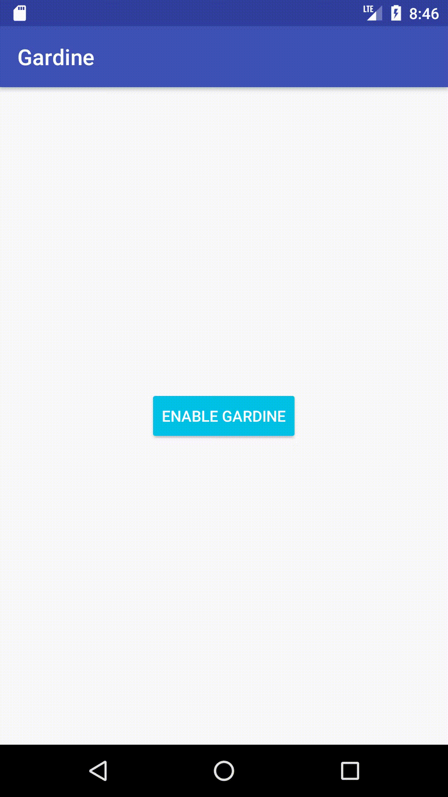

# Gardine - a minimalistic app switcher for Android

On Asus Zenfone (ZenUI) there was a cool gesture of swapping to the previous app by scrolling on an edge of a display.

Inspired by that idea I've developed a Gardine for my Xiaomi Redmi 4X device. 

Application requires 2 permissions:

- accessibility service, has to be enabled manually
- permission to draw overlays (a widget that is always on top)

UPDATE:
On MIUI >= 11 there is addition permission required. Since it is specific to MIUI only I did not add automatic request, but you can grant permission manually to the Gardine:
`Settings app` > `Other permissions` > `Display pop-up windows while running in the background`

A screencast how it works:

After granting permissions - click `Enable Gardine` button and transperent widget will be added to the right edge of your device.

In the right upper corner you will see tiny red button to destroy widget.

Now swiping a bit from the right corner to the left will show a list with recent applications.

Do not relese a finger!

By moving the finger up or down a required app can be selected.

By releasing the finger highlighted app will be started.

Enjoy.

## Installation

## Donate

Bitcoin: bc1qz3avvmrkh93y6rq6jp9yhm8n5v78s06n8aghu4

